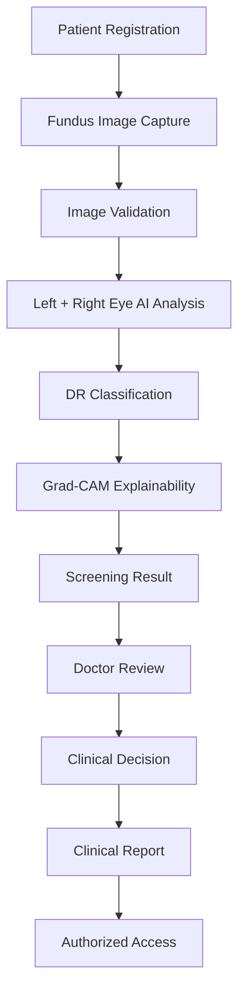
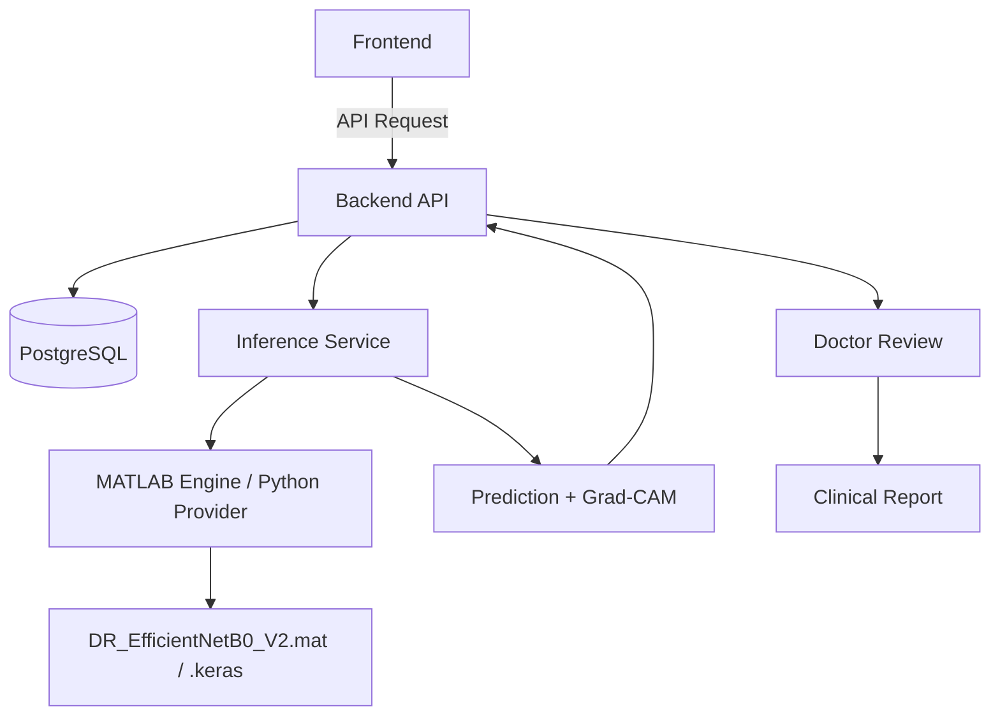

<div align="center">
  
# Vision AI

### Explainable AI for Diabetic Retinopathy Screening in Rural India

**SIH26038**

**Team Viltrumites**

<p align="center">
  
  
  
  
  
  
  
  
  
  
  
</p>

Vision AI is an AI-assisted diabetic retinopathy screening platform designed around a rural healthcare workflow. It combines bilateral fundus-image analysis, explainability, secure clinical workflows, doctor review, and clinical reporting.

**[Note: The AI strictly assists the screening process. The reviewing doctor makes the final clinical decision.]**

</div>

---

## 📋 Project Information

- **Problem Statement:** SIH26038
- **Team:** Viltrumites
- **Team Leader:** Akshay Kumar Verma
- **Members:** Anshu Kumar, Aditi Gargi, Sudarshan Kumar, Krishna Kumar, Aditya Singh

---

## 📑 Table of Contents

- [Overview](#-overview)
- [The Problem](#-the-problem)
- [The Solution](#-the-solution)
- [Core Workflow](#-core-workflow)
- [Platform](#-platform)
- [System Architecture](#-system-architecture)
- [AI Model](#-ai-model)
- [Explainability](#-explainability)
- [Doctor-in-the-Loop](#-doctor-in-the-loop)
- [Simulation](#-simulation)
- [Security](#-security)
- [Technology Stack](#-technology-stack)
- [Project Structure](#-project-structure)
- [Local Development](#-local-development)
- [Platform Screenshots](#-platform-screenshots)
- [Team](#-team)
- [Limitations](#-limitations)
- [Future Work](#-future-work)
- [License](#-license)

---

## 📖 Overview

Vision AI is an AI-assisted diabetic retinopathy (DR) screening workflow built for resource-constrained rural healthcare environments. By connecting local screening staff capturing bilateral fundus images with remote ophthalmologists, the system facilitates early detection of diabetic retinopathy. The platform handles secure patient registration, image validation, AI inference, Grad-CAM visualization, and final clinical review coordination.

---

## 🚨 The Problem

Diabetic retinopathy is a leading cause of preventable blindness. In rural India, early screening is constrained by:
- A critical shortage of available ophthalmologists and specialists.
- The heavy travel burden placed on patients who must commute to urban centers for preliminary screening.
- A need for rapid, assistive screening tools to prioritize critical cases without replacing human medical judgement.
- The challenge of maintaining a secure, accountable "doctor-in-the-loop" model in a distributed setting.

---

## 💡 The Solution

Vision AI addresses these constraints by introducing an AI-assisted triage system at the rural grassroots level. The solution follows a secure clinical pipeline:



---

## 🔄 Core Workflow

The current Vision AI V2 workflow for rural screening is structured as follows:

1. **Patient registration:** Screening staff registers the patient at the facility.
2. **Left-eye image upload:** Staff uploads the left eye fundus image.
3. **Right-eye image upload:** Staff uploads the right eye fundus image.
4. **Image validation:** Basic integrity checks are performed before inference.
5. **AI inference:** The inference service processes the images independently.
6. **Eye-specific classification:** A 5-class prediction is returned for each eye.
7. **Grad-CAM generation:** Visual attention heatmaps are generated for each image.
8. **Review queue:** The screening enters the "Pending Review" workflow.
9. **Doctor reviews AI results and images:** A remote ophthalmologist logs in to evaluate the patient data, AI assessment, and Grad-CAM visualizations.
10. **Doctor records final clinical decision:** The doctor makes the final, authoritative clinical diagnosis.
11. **Clinical report generated:** A secure clinical report is finalized.
12. **Authorized users access the report:** The originating facility staff and the patient can securely retrieve the report.

---

## 💻 Platform

Vision AI implements distinct role-based portals tailored to specific workflows:

### Screening Staff
Patient registration and bilateral fundus image submission at the rural facility level.

### Doctor
AI-assisted screening review, full-resolution image inspection, Grad-CAM visualization assessment, clinical decision entry, and report authorization.

### Admin
Overall system management, user and facility provisioning, screening oversight, and administrative security controls.

### Patient
Secure access to finalized clinical information and reports (where implemented).

---

## 🏗️ System Architecture



---

## 🧠 AI Model

The core inference engine utilizes the canonical `DR_EfficientNetB0_V2.mat` (and `.keras` transplanted weight equivalent). 

It performs a 5-class classification of Diabetic Retinopathy on a per-eye basis:

| Class | Meaning |
|---:|---|
| 0 | No DR |
| 1 | Mild |
| 2 | Moderate |
| 3 | Severe |
| 4 | Proliferative |

The current workflow independently analyzes the Left Eye and the Right Eye. 
*(Note: The system processes standard bilateral images and does not utilize a 3-image mosaic per eye or ensemble inference.)*

---

## 👁️ Explainability

To build clinical trust, the model utilizes **Grad-CAM** (Gradient-weighted Class Activation Mapping). 

Grad-CAM provides a visualization of the model's activation/attention associated with its prediction.

**IMPORTANT LIMITATION:**
Grad-CAM is strictly an attention visualization. It is **NOT**:
- A medically validated lesion segmentation map.
- A lesion boundary detection algorithm.
- Ground-truth lesion localization.

---

## 👨‍⚕️ Doctor-in-the-Loop

**AI prediction ≠ final clinical decision.**

Vision AI strictly isolates the AI's assistive assessment from the final medical diagnosis. The AI produces an assistive screening assessment to prioritize review queues and highlight regions of interest.

The remote reviewing doctor assesses:
- The raw, full-resolution fundus images
- Eye-specific AI results and classification
- Probabilities (where available)
- Grad-CAM attention heatmaps
- Relevant patient and screening context

The doctor then manually records the final clinical decision. The final clinical report is generated exclusively from the completed doctor review workflow, fully overriding the initial AI prediction in the clinical record.

---

## ⚙️ Simulation

A distinct MATLAB/Simulink component supports the broader rural deployment strategy:
- Screening workflow simulation
- Rural resource planning
- System and facility resource behavior modelling

These simulations model facility load and triage bottlenecks, separate from the primary web application production architecture.

---

## 🔒 Security

Vision AI implements robust defense-in-depth security mechanisms natively in the application layer:
- **Authentication:** Secure cookie/session-based authentication.
- **Role-Based Access Control:** Strict RBAC across all API boundaries.
- **Facility Scoping:** Staff can only access patient data tied to their assigned facility.
- **Protected Data:** Patient records, images, and reports are protected via authorization checks.
- **IDOR Protection:** Insecure Direct Object Reference protections on sensitive endpoints.
- **Password Hashing:** Secure credential storage using bcrypt.
- **Environment Secrets:** Sensitive keys stored securely in `.env` files.

---

## 🛠️ Technology Stack

| Layer | Technology |
|---|---|
| Frontend | React, Vite, TailwindCSS |
| Backend | Node.js, Express, TypeScript |
| Database | PostgreSQL |
| ORM | Prisma |
| AI Inference | Python, FastAPI |
| Model | EfficientNetB0 (V2) |
| Explainability | Grad-CAM |
| Simulation | MATLAB / Simulink |
| Containerization | Docker |

---

## 📂 Project Structure

```text
Vision-AI/
├── backend/
├── config/
├── docs/
├── frontend/
├── inference_service/
├── licenses/
├── matlab/
├── model/
├── docker-compose.yml
├── .env.example
├── .gitignore
└── README.md
```

---

## 💻 Local Development

**Prerequisites:** Docker, Docker Compose, and Node.js.

1. **Environment Setup:**
   Duplicate the provided `.env.example` file and configure your local settings.
   ```bash
   cp .env.example .env
   # Ensure backend/.env and frontend/.env are appropriately populated
   ```

2. **Start Docker Services:**
   Run the following from the repository root to start PostgreSQL, Backend API, Frontend, and Inference Service:
   ```bash
   docker compose up --build
   ```

*(Note: The MATLAB Web Desktop is not a public service and is excluded from the standard production deployment stack. Ensure MATLAB Engine prerequisites are satisfied locally if utilizing the MATLAB provider for inference).*

---

## 📸 Platform Screenshots

### Screening Staff
<!-- Add actual screenshot here -->

### AI Screening
<!-- Add actual screenshot here -->

### Doctor Review
<!-- Add actual screenshot here -->

### Admin Dashboard
<!-- Add actual screenshot here -->

### Clinical Report
<!-- Add actual screenshot here -->

### Explainability / Grad-CAM
<!-- Add actual screenshot here -->

---

## 👥 Team

**Team Viltrumites**

**Team Leader:**
- Akshay Kumar Verma

**Members:**
- Anshu Kumar
- Aditi Gargi
- Sudarshan Kumar
- Krishna Kumar
- Aditya Singh

---

## ⚠️ Limitations

- **Single Image per Eye:** The current workflow strictly supports one image per eye (bilateral).
- **Explainability:** Grad-CAM illustrates network attention, not explicit lesion segmentation.
- **Clinical Validation:** The model represents a prototype-stage implementation and lacks rigorous longitudinal clinical validation across varied demographics.
- **Storage:** Images are currently persisted locally via Docker volumes rather than scalable cloud object storage.

---

## 🚀 Future Work

- Expansion to support multiple fundus images per eye.
- Dedicated lesion segmentation models.
- Migration to robust S3-compatible external object storage.
- Expanded Simulink rural resource planning models.
- Improved and expanded clinical validation.

---

## 📄 License

Copyright (c) 2026. All rights reserved.
