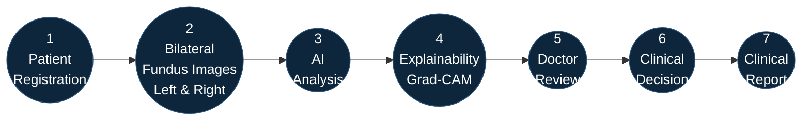
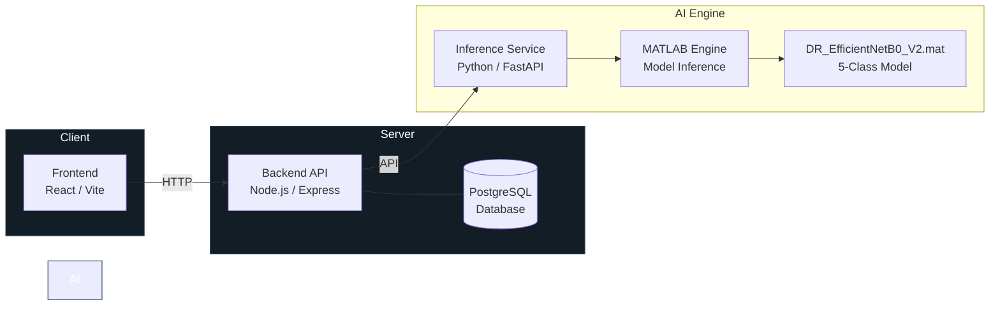
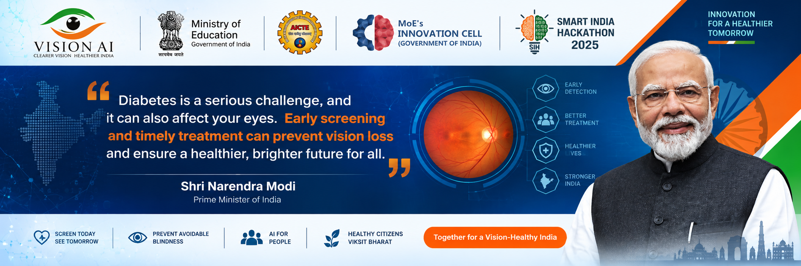
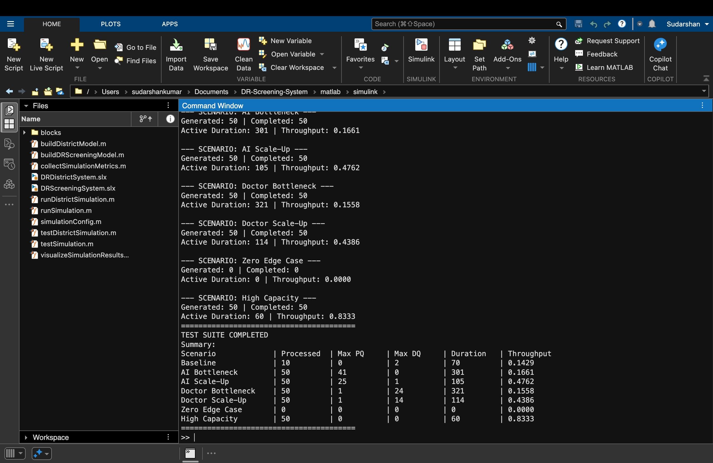

# VISION AI

### Explainable AI for Diabetic Retinopathy Screening in Rural India
**SIH26038 · Team Viltrumites**

  
  
  
  
  
  
  
  

An AI-assisted screening platform connecting rural screening staff with remote ophthalmologists.

 

[Overview](#overview) &nbsp;&nbsp;&nbsp; [Workflow](#clinical-workflow) &nbsp;&nbsp;&nbsp; [Architecture](#system-architecture) &nbsp;&nbsp;&nbsp; [AI Model](#ai-model) &nbsp;&nbsp;&nbsp; [Explainability](#explainability) &nbsp;&nbsp;&nbsp; [Simulation](#simulation) &nbsp;&nbsp;&nbsp; [Security](#security) &nbsp;&nbsp;&nbsp; [Setup](#setup) &nbsp;&nbsp;&nbsp; [Team](#team-viltrumites)

---

## Overview

Vision AI addresses the shortage of ophthalmologists in rural India by providing a secure, explainable, and AI-assisted diabetic retinopathy (DR) screening platform. The system enables screening staff to capture bilateral fundus images, leverages deep learning for initial analysis with explainability, and integrates a doctor-in-the-loop workflow for final clinical decision and reporting.

- AI-assisted triage for early DR screening in rural settings
- Bilateral eye analysis with explainability (Grad-CAM)
- Secure, role-based clinical workflow (Admin, Doctor, Staff, Patient)
- Rural deployment simulation using MATLAB/Simulink for resource planning

---

## Clinical Workflow

---

## System Architecture

---

## AI Model

The system uses a custom-trained **EfficientNetB0** model (`DR_EfficientNetB0_V2.mat`) for 5-class diabetic retinopathy classification. Left and right eye images are processed independently, and Grad-CAM is used to provide model attention visualization for clinical interpretability.

> [!NOTE]
> Grad-CAM highlights regions that influenced the model's prediction. It is an attention visualization tool and not a clinically validated lesion segmentation map.

| Class | Diagnosis |
|:---:|:---|
| 0 | No DR |
| 1 | Mild |
| 2 | Moderate |
| 3 | Severe |
| 4 | Proliferative |

---

## Explainability & Simulation

<table width="100%" style="border: none;">
  <tr>
    <td width="50%" align="center" style="border: none;">
      <b>Clinical Explainability</b>  
      
    </td>
    <td width="50%" align="center" style="border: none;">
      <b>MATLAB/Simulink Rural Simulation</b>  
      
      
    </td>
  </tr>
</table>

---

<table width="100%">
<tr>
<td width="50%" valign="top">

## Technology Stack

| Layer | Technology |
|---|---|
| **Frontend** | React, TypeScript, Vite |
| **Backend** | Node.js, Express |
| **Database** | PostgreSQL |
| **AI Inference** | Python, FastAPI, MATLAB Engine |
| **Model** | EfficientNetB0 (`DR_EfficientNetB0_V2.mat`) |
| **Simulation** | MATLAB, Simulink |
| **Containerization** | Docker, Docker Compose |

</td>
<td width="50%" valign="top">

## Team Viltrumites

| Name | Role |
|---|---|
| **Akshay Kumar Verma** | Team Leader |
| **Anshu Kumar** | Team Member |
| **Aditi Gargi** | Team Member |
| **Sudarshan Kumar** | Team Member |
| **Krishna Kumar** | Team Member |
| **Aditya Singh** | Team Member |

</td>
</tr>
</table>

---

<table width="100%">
<tr>
<td width="50%" valign="top">

## Future Work

- Multi-image per eye processing
- Expanded model validation
- Dedicated segmentation models
- Scalable external object storage
- Enhanced rural simulation models
- Deployment optimization

</td>
<td width="50%" valign="top">

## License

Copyright © 2026. All rights reserved.

This project is developed for Smart India Hackathon (SIH26038) under Team Viltrumites.

</td>
</tr>
</table>
