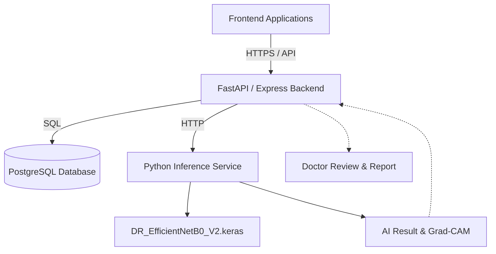

# Vision AI

## SIH26038 — MathWorks Explainable AI for Diabetic Retinopathy Screening in Rural India

Vision AI is a highly specialized, locally deployable Diabetic Retinopathy (DR) screening platform designed to operate in resource-constrained rural healthcare environments. 

**The Problem:** 
Diabetic retinopathy is a leading cause of preventable blindness, but early screening is severely constrained in rural India due to a critical shortage of ophthalmologists. Patients often do not have the resources to travel to urban centers merely for screening.

**The Solution:**
Vision AI introduces an AI-assisted triage system at the rural grassroots level. Paramedics and screening staff can capture fundus images and upload them locally. A deep learning model analyzes the images, detects potential pathology, and flags critical cases. Explainability (Grad-CAM) helps visualize the AI's attention, supporting a "doctor-in-the-loop" workflow where a remote ophthalmologist ultimately confirms the diagnosis and provides a clinical report without needing the patient to travel unless intervention is required.

## Overview

The Vision AI architecture comprises a React-based frontend for distinct user roles (Admin, Doctor, Staff, Patient), a robust Node.js/PostgreSQL backend for secure clinical data management, and an isolated Python inference service serving an EfficientNetB0-based 5-class DR classification model.

## Core Workflow

1. **Patient registration:** Screening staff registers a patient at a rural facility.
2. **Fundus image capture/upload:** Staff securely uploads bilateral (left/right eye) fundus images.
3. **Image quality validation:** System validates basic image integrity before inference.
4. **AI analysis:** The inference service securely analyzes both images.
5. **Bilateral eye assessment:** Independent classification is returned for each eye.
6. **Explainability / Grad-CAM:** Heatmaps are generated representing the regions influencing the AI's prediction.
7. **Screening result:** The system aggregates the findings into a triage status (e.g., Pending Review).
8. **Doctor review:** A remote ophthalmologist logs in, reviews the images, AI predictions, and heatmaps.
9. **Clinical decision:** The doctor makes the final, authoritative clinical diagnosis.
10. **Report generation:** A secure, downloadable clinical report is finalized.
11. **Patient/staff access:** The report is securely accessible to the originating facility staff and the patient.

## System Architecture



## AI Model

The core inference engine uses a custom-trained **EfficientNetB0-based** architecture, capable of 5-class Diabetic Retinopathy classification.

| Class | Meaning |
|------:|---------|
| 0 | No DR |
| 1 | Mild |
| 2 | Moderate |
| 3 | Severe |
| 4 | Proliferative |

**Preprocessing:**
- Inputs are resized via bilinear interpolation.
- Images are converted to 3-channel RGB float tensors normalized for the EfficientNet pipeline.

## Bilateral Screening

The current V2 workflow requires two standard fundus images per screening:
- Left Eye
- Right Eye

The inference service processes these independently, returning distinct classifications and heatmaps for each eye, allowing the reviewing doctor to assess bilateral asymmetry in pathology.

## Doctor-in-the-Loop Review

Vision AI strictly isolates **AI Prediction** from **Clinical Decision**.
The AI acts exclusively as an assistive triage mechanism. A remote ophthalmologist is presented with the raw images, the AI's 5-class prediction, and the Grad-CAM visualization. The doctor then inputs the final clinical decision, which overrides the AI prediction in all official clinical reports.

## Explainability

To build clinical trust, the model utilizes **Grad-CAM** (Gradient-weighted Class Activation Mapping). 
Grad-CAM represents model attention/activation regions associated with the specific prediction. 

*Limitation Note:* Grad-CAM visualizes where the AI "looked" to make its decision. It is an attention visualization tool and is **not** a medically validated diagnostic lesion segmentation map.

## Backend

The backend is built with Node.js/TypeScript and Express, featuring:
- Secure JWT-based authentication
- Strict Role-Based Access Control (RBAC)
- Patient and clinical workflow management
- Doctor review pipeline orchestration
- Secure, IDOR-protected local storage authorization for clinical imagery
- Segregated administrative, clinical, and staff API trees

## Frontend

The frontend is a unified React application (Next.js/Vite) providing distinct workflows:
- **Admin Dashboard:** System-wide metrics, patient management, staff/doctor provisioning, and real-time monitoring.
- **Doctor Dashboard:** Clinical review queue, AI assessment viewer, and diagnostic reporting interface.
- **Staff Portal:** Patient registration and bilateral fundus image uploading.
- **Patient Access:** Secure retrieval of finalized clinical reports.

## Database

The PostgreSQL database (managed via Prisma ORM) securely handles all relationships. Key models include:
- `User` / `UserCredential` (Identity management)
- `Role` based enums
- `Patient` (Clinical subjects)
- `Screening` & `ScreeningImage` (Screening events and bilateral imagery)
- `ClinicalReview` & `ClinicalReport` (Doctor evaluations and final outputs)
- `Facility` (Rural deployment mapping)

## Security

Vision AI implements defense-in-depth security mechanisms:
- Standardized authentication via HTTP-only cookies.
- Strict role-based authorization checking per endpoint.
- Facility scoping (Staff can only access patients within their assigned facility).
- IDOR (Insecure Direct Object Reference) protections on all image and report retrieval endpoints.
- Secure password hashing and credential handling.
- Segregated `.env` secrets management.

## Local Development

1. Ensure Docker and Docker Compose are installed.
2. Configure `.env` files in `backend/.env` and `frontend/.env` based on `.env.example`.
3. Run `npm install` inside both `frontend/` and `backend/`.
4. From the repository root, start the stack:
   ```bash
   docker compose up --build
   ```

*Note:* MATLAB Web Desktop is **not** a public production component and is omitted from the core Docker stack. The MATLAB reference algorithms in `matlab/` are retained exclusively for algorithm verification and simulation modeling.

## Docker

The `docker-compose.yml` orchestrates:
- `database`: PostgreSQL 16
- `inference`: Python-based inference service wrapping the V2 Keras model
- `backend`: Node.js API and Prisma ORM
- `frontend`: React/Nginx static delivery

## Environment Variables

The system relies on securely injected environment variables. Example parameters (do not commit actual secrets):
- `DATABASE_URL`
- `JWT_SECRET`
- `NODE_ENV`
- `INFERENCE_SERVICE_URL`
- `PORT`

## API

Key API boundaries are strictly segregated by role:
- `/api/auth/*` — Session management and credential issuance
- `/api/admin/*` — Facility, user, and global patient management (Admin only)
- `/api/doctor/*` — Review queue and report submission (Doctor only)
- `/api/staff/*` — Patient registration and image uploading (Staff only)

## Testing

Backend typings and schema constraints can be validated via:
```bash
cd backend
npx prisma generate
npx tsc -b
```

Frontend UI integrity is validated via:
```bash
cd frontend
npx tsc -b
npm run build
```

## Current Limitations

- **Image Count:** The current screening API strictly supports one image per eye (bilateral). It does not natively support 3-image mosaic screening.
- **Clinical Validation:** The model is technically verified but remains in a prototype stage without rigorous longitudinal clinical validation against diverse demographics.
- **Grad-CAM Interpretation:** Explanations represent network activation, not explicit segmentation of microaneurysms or hemorrhages.
- **Storage:** Images are currently persisted locally via Docker volumes.

## Future Work

- Expansion to multi-image per eye processing for wider retinal capture.
- Implementation of distinct segmentation models for precise lesion mapping.
- Migration to robust S3-compatible external object storage.
- Expanded rural simulation models (Simulink) for national deployment resource planning.

## Project Structure

```text
.
├── backend/            # Express API & Prisma database schema
├── docs/               # Technical architecture & simulation documentation
├── frontend/           # React application (Admin, Doctor, Staff workflows)
├── inference_service/  # Python FastApi service wrapping the V2 Model
├── matlab/             # Reference MATLAB Engine algorithms and Simulink models
├── model/              # Canonical DR_EfficientNetB0_V2 weights and configs
└── docker-compose.yml  # Production deployment stack
```

## License

Copyright (c) 2026. All rights reserved.
