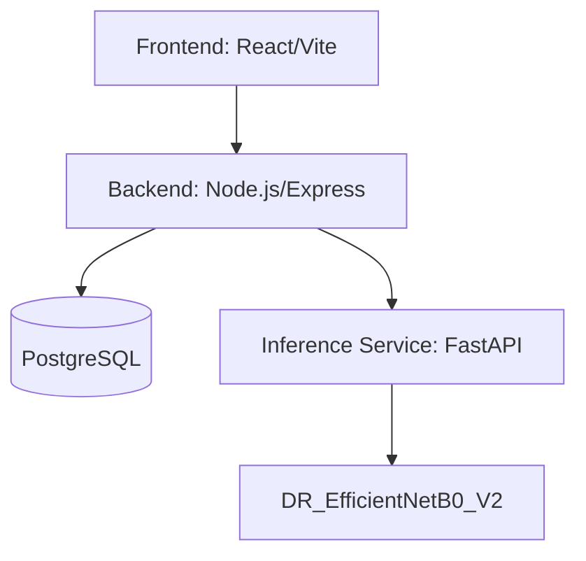

<div align="center">
  


# VISION AI

**Explainable AI for Diabetic Retinopathy Screening in Rural India**  
*SIH26038 | Team Viltrumites*

<p align="center">
  
  
  
  
  
  
  
</p>

An AI-assisted triage platform connecting rural screening staff with remote ophthalmologists.

</div>

---

## ⚡ Overview

**Vision AI** tackles the critical shortage of ophthalmologists in rural India by providing a fast, secure, and explainable AI-assisted screening platform.

- **Bilateral Analysis**: Independent screening for Left & Right eyes.
- **Explainable AI**: Grad-CAM attention heatmaps for clinical trust.
- **Doctor-in-the-Loop**: AI assists; the remote doctor makes the final clinical decision.
- **Role-Based Portals**: Tailored workflows for Admin, Doctor, Staff, and Patient.

---

## 🔄 Clinical Workflow

<div align="center">
  
</div>

1. **Staff** registers patient and uploads bilateral fundus images.
2. **AI Inference** processes images and returns a 5-class DR prediction per eye + Grad-CAM heatmap.
3. **Doctor** reviews the AI assessment and full-resolution images remotely.
4. **Final Decision** is recorded by the doctor, generating a secure clinical report.

---

## 🏗️ System Architecture



---

## 🧠 AI Model & Explainability

- **Model**: `DR_EfficientNetB0_V2` (5-Class Classification: No DR, Mild, Moderate, Severe, Proliferative)
- **Explainability**: **Grad-CAM** generates heatmaps showing where the AI focused. *(Note: This is an attention visualization, not diagnostic lesion segmentation).*

<div align="center">
  
</div>

---

## ⚙️ Rural Simulation (MATLAB/Simulink)

We utilize **MATLAB** and **Simulink** to simulate rural screening deployment, optimizing resource planning and identifying facility bottlenecks.

<div align="center">
  
  
</div>

---

## 🛠️ Quick Start

**Prerequisites**: Docker, Docker Compose, Node.js

```bash
# 1. Setup Environment
cp .env.example .env

# 2. Launch Platform
docker compose up --build
```

---

## 👥 Team Viltrumites

| Role | Member |
|------|--------|
| **Team Leader** | Akshay Kumar Verma |
| **Members** | Anshu Kumar, Aditi Gargi, Sudarshan Kumar, Krishna Kumar, Aditya Singh |

---
<div align="center">
  <i>Copyright © 2026. All rights reserved.</i>
</div>
