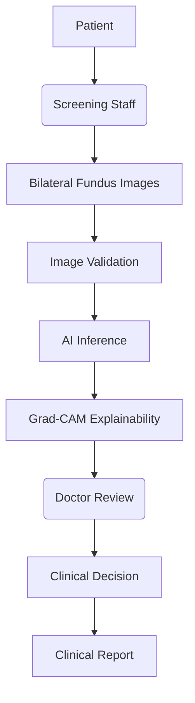
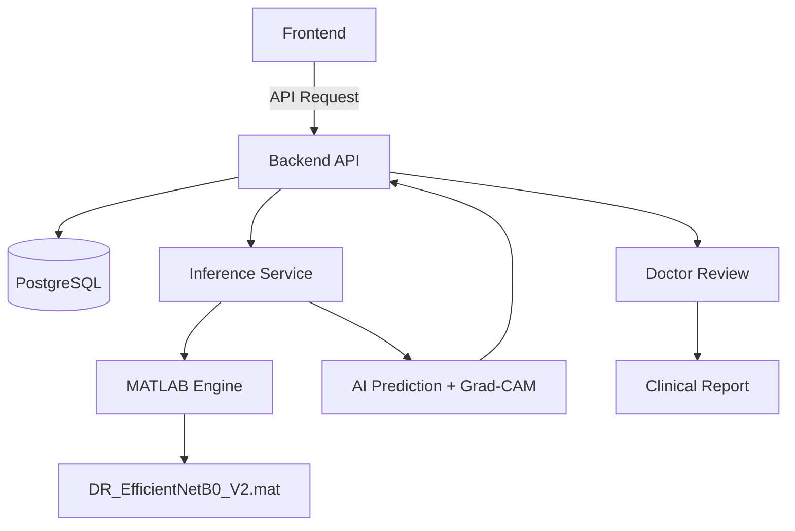

<div align="center">
  
# VISION AI
**MathWorks Explainable AI for Diabetic Retinopathy Screening in Rural India**
*SIH26038*

<p align="center">
  
  
  
  
  
  
  
  
  
  
  
</p>

Vision AI is an AI-assisted diabetic retinopathy (DR) screening workflow built for rural healthcare contexts. Screening staff capture patient information and bilateral fundus images. An AI model analyzes the images, generating predictions and Grad-CAM explainability heatmaps. A remote ophthalmologist then reviews the AI-assisted assessment in a doctor-in-the-loop clinical workflow before the final clinical report is issued.

**[Note: The AI acts strictly as an assistive screening tool. The doctor provides the final clinical decision.]**

</div>

---

## 📋 Table of Contents

- [Project Identity](#-project-identity)
- [Overview](#-overview)
- [The Problem](#-the-problem)
- [The Solution](#-the-solution)
- [Screening Workflow](#-screening-workflow)
- [Architecture](#-architecture)
- [AI Model](#-ai-model)
- [Bilateral Screening & Explainability](#-bilateral-screening--explainability)
- [Doctor-in-the-Loop](#-doctor-in-the-loop)
- [Platform Roles](#-platform-roles)
- [Technology Stack](#-technology-stack)
- [MATLAB & Simulink](#-matlab--simulink)
- [Security](#-security)
- [Local Development](#-local-development)
- [Docker](#-docker)
- [Project Structure](#-project-structure)
- [Platform Screenshots](#-platform-screenshots)
- [Limitations](#-limitations)
- [Future Work](#-future-work)
- [Team](#-team)
- [License](#-license)

---

## 🔖 Project Identity

- **Problem Statement:** SIH26038
- **Problem Title:** MathWorks Explainable AI for Diabetic Retinopathy Screening in Rural India
- **Team Name:** Viltrumites

---

## 📖 Overview

Vision AI provides an AI-assisted DR screening workflow designed to operate in resource-constrained rural healthcare environments. By connecting local screening staff capturing bilateral fundus images with remote ophthalmologists, the system facilitates early detection of diabetic retinopathy. The platform handles secure patient registration, image validation, AI inference, Grad-CAM visualization, and final clinical review coordination.

---

## 🚨 The Problem

Diabetic retinopathy is a leading cause of preventable blindness. In rural India, early screening is constrained by:
- A critical shortage of available ophthalmologists and specialists.
- The heavy travel burden placed on patients who must commute to urban centers for preliminary screening.
- A need for rapid, assistive screening tools to prioritize critical cases without replacing human medical judgement.
- The challenge of maintaining a secure, accountable "doctor-in-the-loop" model in a distributed setting.

---

## 💡 The Solution

Vision AI addresses these constraints by introducing an AI-assisted triage system at the rural grassroots level. The solution follows a secure clinical pipeline:



---

## 🔄 Screening Workflow

The current Vision AI V2 workflow for rural screening is structured as follows:

1. **Patient registration:** Screening staff registers the patient at the facility.
2. **Left-eye image upload:** Staff uploads the left eye fundus image.
3. **Right-eye image upload:** Staff uploads the right eye fundus image.
4. **Image validation:** Basic integrity checks are performed before inference.
5. **AI inference:** The inference service processes the images independently.
6. **Eye-specific classification:** A 5-class prediction is returned for each eye.
7. **Grad-CAM generation:** Visual attention heatmaps are generated for each image.
8. **Review queue:** The screening enters the "Pending Review" workflow.
9. **Doctor reviews AI results and images:** A remote ophthalmologist logs in to evaluate the patient data, AI assessment, and Grad-CAM visualizations.
10. **Doctor records final clinical decision:** The doctor makes the final, authoritative clinical diagnosis.
11. **Clinical report generated:** A secure clinical report is finalized.
12. **Authorized users access the report:** The originating facility staff and the patient can securely retrieve the report.

---

## 🏗️ Architecture



---

## 🧠 AI Model

The core inference engine utilizes `DR_EfficientNetB0_V2.mat`.

It performs a 5-class classification of Diabetic Retinopathy:

| Class | Diagnosis |
|------:|-----------|
| 0 | No DR |
| 1 | Mild |
| 2 | Moderate |
| 3 | Severe |
| 4 | Proliferative |

---

## 👁️ Bilateral Screening & Explainability

**Bilateral Screening:**
Each eye is processed independently. The system strictly requires one left eye image and one right eye image per screening. The AI returns eye-specific predictions and explainability artifacts, allowing the reviewing doctor to assess bilateral asymmetry in pathology.

**Explainability (Grad-CAM):**
To build clinical trust, the model utilizes Grad-CAM (Gradient-weighted Class Activation Mapping). Grad-CAM provides a visualization of the model's activation and attention associated with its prediction.

*Limitation Note:* Grad-CAM visualizes where the AI "looked" to make its decision. It is an attention visualization rather than a medically validated diagnostic lesion segmentation map.

---

## 👨‍⚕️ Doctor-in-the-Loop

AI Prediction != Clinical Decision.

Vision AI strictly isolates the AI's assistive assessment from the final medical diagnosis. The doctor reviews:
- The raw fundus images
- AI predictions and probabilities (where available)
- Grad-CAM visualizations
- Relevant patient and screening context

The doctor records the final clinical decision, and the final clinical report reflects the doctor's decision exclusively, overriding the AI prediction in all official documentation.

---

## 👥 Platform Roles

Vision AI implements distinct role-based portals:

- **Admin:** Manages system-wide metrics, facility mapping, staff/doctor provisioning, and system monitoring.
- **Doctor:** Accesses the clinical review queue, evaluates AI-assisted screening assessments, and issues diagnostic reports.
- **Screening Staff:** Registers patients and uploads bilateral fundus images at rural screening facilities.
- **Patient:** Securely retrieves their finalized clinical reports.

---

## 💻 Technology Stack

| Layer | Technology |
|------|------------|
| Frontend | React, Vite, TailwindCSS |
| Backend | Node.js, Express, TypeScript |
| Database | PostgreSQL |
| ORM | Prisma |
| AI Inference | Python, FastAPI, MATLAB Engine |
| Model | EfficientNetB0 (V2) |
| Explainability | Grad-CAM |
| Simulation | MATLAB / Simulink |
| Containerization | Docker |

---

## ⚙️ MATLAB / Simulink

- **MATLAB Engine:** Used in the AI inference pipeline to run the compiled model artifact (`DR_EfficientNetB0_V2.mat`) and generate predictions and Grad-CAM visualizations.
- **Simulink:** Utilized for rural screening resource-planning simulation work to model facility load and triage bottlenecks.

---

## 🔒 Security

Vision AI implements defense-in-depth security mechanisms:
- Standardized authentication via secure cookies/sessions.
- Strict role-based authorization for all API routes.
- Facility scoping (staff can only access patients within their assigned facility).
- Protected patient data and protected image/report access.
- IDOR (Insecure Direct Object Reference) protections on sensitive endpoints.
- Secure password hashing using bcrypt.
- Environment-based secrets management.

---

## 🛠️ Local Development

1. **Prerequisites:** Ensure Docker and Docker Compose are installed.
2. **Environment Variables:** Configure `.env` files in `backend/.env` and `frontend/.env` based on `.env.example`.
3. **Install Dependencies:**
   ```bash
   cd frontend && npm install
   cd ../backend && npm install
   ```
4. **Start the Stack:** From the repository root, start the services:
   ```bash
   docker compose up --build
   ```

*(Note: Ensure proper MATLAB Engine licensing or runtime prerequisites are configured on the host machine or within the inference container as required by the Python/MATLAB integration).*

---

## 🐳 Docker

The application relies on `docker-compose.yml` to orchestrate the following services:
- **`database`**: PostgreSQL instance for robust data persistence.
- **`backend`**: Node.js API server handling business logic and Prisma ORM.
- **`frontend`**: React frontend served for distinct user portals.
- **`inference`**: Python-based inference service wrapping the MATLAB model.

---

## 📂 Project Structure

```text
Vision-AI/
├── backend/            # Express API, Prisma schema, auth middleware
├── config/             # Environment and platform configurations
├── docs/               # Technical architecture & simulation documentation
├── frontend/           # React application (Admin, Doctor, Staff, Patient workflows)
├── inference_service/  # Python FastAPI service & MATLAB Engine integration
├── licenses/           # Project licenses
├── matlab/             # Reference algorithms and Simulink models
├── model/              # Canonical DR_EfficientNetB0_V2.mat artifact
├── docker-compose.yml  # Docker orchestration
├── .gitignore
└── README.md
```

---

## 📸 Platform Screenshots

### Screening Staff Workflow

<!-- Add screening staff workflow screenshot here later -->

### Doctor Review

<!-- Add doctor review screenshot here later -->

### Admin Dashboard

<!-- Add admin dashboard screenshot here later -->

### Patient Report

<!-- Add patient report screenshot here later -->

### Grad-CAM Explainability

<!-- Add actual Grad-CAM example here later -->

---

## ⚠️ Limitations

- **Single Image per Eye:** The current screening API exclusively supports one image per eye.
- **Clinical Validation:** The model represents a prototype-stage implementation and lacks rigorous longitudinal clinical validation against diverse demographics.
- **Grad-CAM Interpretation:** Explanations represent network attention rather than explicit lesion segmentation.
- **Local Storage:** Images are currently persisted locally via Docker volumes rather than scalable cloud object storage.
- **MATLAB Licensing:** Full inference deployment may be constrained by MATLAB Engine licensing requirements.

---

## 🚀 Future Work

- Expansion to support multiple fundus images per eye (e.g., macula-centered and optic disc-centered views).
- Improved and expanded clinical validation across wider demographic distributions.
- Implementation of dedicated lesion segmentation models.
- Migration to scalable external object storage (e.g., AWS S3) for secure image archiving.
- Expanded Simulink rural resource planning for optimized national deployment strategies.
- Overall deployment and inference optimization.

---

## 👥 Team

| Member | Role |
|--------|------|
| Akshay Kumar Verma | Team Leader |
| Anshu Kumar | Team Member |
| Aditi Gargi | Team Member |
| Sudarshan Kumar | Team Member |
| Krishna Kumar | Team Member |
| Aditya Singh | Team Member |

<!-- Team photos can be added here later -->

---

## 📄 License

Copyright (c) 2026. All rights reserved.
