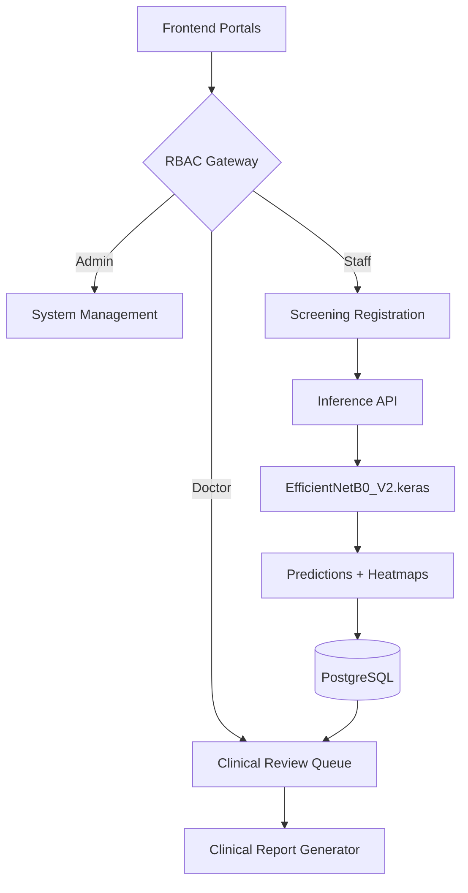
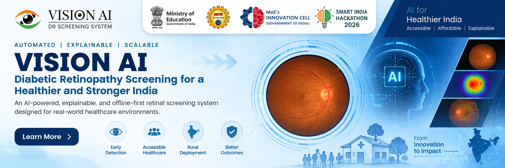
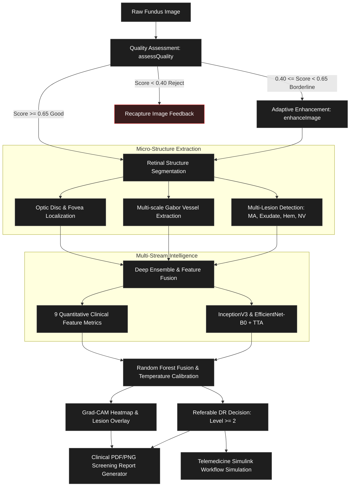
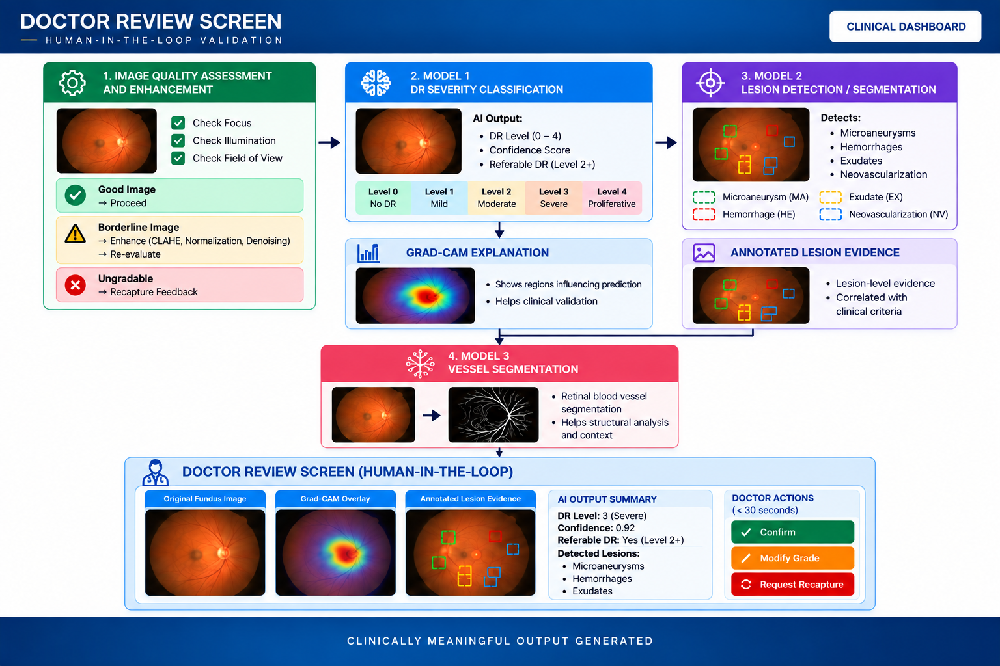
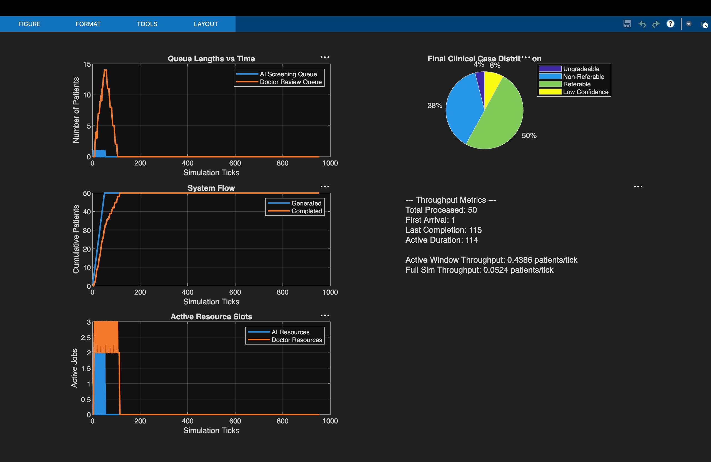

<div align="center">


<br />

# Vision AI

<h3><strong>Explainable AI for Diabetic Retinopathy Screening in Rural India</strong></h3>

<sub>Problem Statement: SIH26038 &nbsp;·&nbsp; Smart India Hackathon 2026</sub>

<br />


<br />

<table>
  <tr>
    <td align="center" width="340">
      <strong>Clinical Dashboard</strong><br />
      <sub>Doctor review panel — full-res images, AI assessment, Grad-CAM</sub><br /><br />
      <a href="#">
        
      </a>
    </td>
    <td align="center" width="340">
      <strong>Inference API</strong><br />
      <sub>FastAPI inference server — /analyze endpoints</sub><br /><br />
      <a href="#">
        
      </a>
    </td>
  </tr>
</table>

</div>

---

## Table of Contents

- [Overview](#overview)
- [Architecture](#architecture)
- [AI Model](#ai-model)
- [Deep Learning Pipeline](#deep-learning-pipeline)
- [Project Structure](#project-structure)
- [Quick Start](#quick-start)
- [API Reference](#api-reference)
- [Platform](#platform)
- [Features](#features)
- [Doctor-in-the-Loop](#doctor-in-the-loop)
- [Explainability](#explainability)
- [Simulation](#simulation)
- [Tech Stack](#tech-stack)
- [Docker Deployment](#docker-deployment)
- [Environment Variables](#environment-variables)
- [Implementation Status](#implementation-status)
- [Team](#team)

---

## Overview

Vision AI is a production-grade, AI-assisted triage system designed for diabetic retinopathy (DR) screening in resource-constrained rural healthcare environments. It securely processes bilateral fundus images in real-time, generates explainable Grad-CAM heatmaps, and coordinates a strict "doctor-in-the-loop" clinical workflow.

The system handles the full screening lifecycle — from rural patient registration and image upload, through AI inference and clinical routing, to ophthalmologist review and final report generation.

| Component | Description |
|---|---|
| **AI Model** | EfficientNetB0 (V2) for 5-class DR classification |
| **Workflow** | Bilateral (Left & Right eye) independent screening |
| **Explainability** | Grad-CAM attention heatmaps |
| **Controls** | Strict RBAC, immutable clinical reports, doctor overrides |
| **Interfaces** | Express API, FastAPI Inference, React Portals |

> **Important:** This project implements an assistive screening pipeline. The AI does not make autonomous diagnoses; the remote doctor provides the final clinical decision.

---

## Architecture

The screening path securely bridges rural screening staff with remote specialists using independent APIs and AI processing.

### Screening Pipeline

```mermaid
flowchart LR
  A[Patient Registration] --> B[Staff Image Upload]
  B --> C[Node.js Gateway]
  C --> D[Image Validation]
  D --> E[Python Inference Service]
  E --> F[Left Eye Analysis]
  E --> G[Right Eye Analysis]
  F --> H[Grad-CAM Generation]
  G --> H
  H --> I[Review Queue]
  I --> J[Doctor Review]
  J --> K[Clinical Decision]
  K --> L[Secure Clinical Report]

  classDef input fill:#e9f5ff,stroke:#1683d8,color:#102a43
  classDef processing fill:#fff4db,stroke:#d97706,color:#4a2600
  classDef review fill:#e9f8ef,stroke:#27945b,color:#123b25
  classDef output fill:#f5efff,stroke:#815ac7,color:#2d1b4e
  class A,B input
  class C,D,E,F,G,H processing
  class I,J,K review
  class L output
```



### System Architecture



<br />
<div align="center">

<br /><sub>Detailed system design and component interaction flow.</sub>
</div>


---

## AI Model

The core inference engine utilizes `DR_EfficientNetB0_V2.mat` (deployed via translated Keras weights) for 5-class diabetic retinopathy classification.

| Class | Diagnosis | Description |
|---|---|---|
| 0 | No DR | No apparent diabetic retinopathy |
| 1 | Mild | Microaneurysms only |
| 2 | Moderate | More than just microaneurysms, but less than severe |
| 3 | Severe | 20+ intraretinal hemorrhages, venous beading, or IRMA |
| 4 | Proliferative | Neovascularization or vitreous/preretinal hemorrhage |

**Bilateral Analysis:** Left and right eyes are processed independently, ensuring accurate lateral assessment for the reviewing doctor.

<br />

<div align="center">

<br /><sub>AI-assisted screening interface demonstrating bilateral analysis and clinical workflow.</sub>
</div>

---

## Deep Learning Pipeline




---

## Project Structure

```
Vision-AI/
├── backend/
│   ├── src/             Express API, Auth Middleware, Routing
│   ├── prisma/          PostgreSQL Database Schema & Migrations
│   ├── Dockerfile       Node.js Container
│   └── package.json
├── config/              Environment templates & configurations
├── docs/                Technical architecture documentation
├── frontend/
│   ├── public/          Static Assets & Images
│   ├── src/             React Application (Admin, Doctor, Staff, Patient)
│   ├── Dockerfile       Nginx Static Delivery
│   └── package.json
├── inference_service/
│   ├── model/           Production Weights & Configs
│   ├── main.py          FastAPI Inference Engine
│   ├── requirements.txt Python Dependencies
│   └── Dockerfile       Python Container
├── licenses/            Open Source Licenses
├── matlab/              Simulink Models & MATLAB Reference Algorithms
├── docker-compose.yml   Production Stack Orchestration
├── .env.example         Environment template
└── README.md            This file
```

---

## Quick Start

**Prerequisites:** Docker, Docker Compose, Node.js (for local dev)

```bash
# Clone repository
git clone https://github.com/SudarshanSingh1/DR-Screening-System.git
cd DR-Screening-System

# Configure credentials
cp .env.example .env
# Ensure environment variables are populated for backend, frontend, and database

# Run full stack (Database + API + Inference + Frontend)
docker compose up --build
```

| Access Point | URL |
|---|---|
| Frontend Portal | http://localhost:3000 |
| Backend API | http://localhost:8080 |
| Inference API | http://localhost:8000 |
| API Health | http://localhost:8000/health |

---

## API Reference

### Analyze Bilateral Fundus Images

```
POST /analyze
```

**Request** (Multipart Form)

- `leftEye`: (File) Left eye fundus image (JPEG/PNG)
- `rightEye`: (File) Right eye fundus image (JPEG/PNG)

**Response**

```json
{
  "leftEye": {
    "success": true,
    "prediction": {
      "classIndex": 2,
      "label": "Moderate",
      "confidence": 0.8421
    },
    "probabilities": [0.05, 0.08, 0.84, 0.02, 0.01],
    "isReferable": true,
    "isLowConfidence": false,
    "gradCam": "data:image/png;base64,..."
  },
  "rightEye": {
    "success": true,
    "prediction": {
      "classIndex": 0,
      "label": "No DR",
      "confidence": 0.9812
    },
    "probabilities": [0.98, 0.01, 0.00, 0.00, 0.00],
    "isReferable": false,
    "isLowConfidence": false,
    "gradCam": "data:image/png;base64,..."
  }
}
```

---

## Platform

The unified React application provides distinct, role-based portals:

| Portal | Purpose |
|---|---|
| **Admin Dashboard** | System-wide metrics, facility mapping, staff/doctor provisioning |
| **Doctor Dashboard** | Clinical review queue, AI assessment viewer, and diagnostic reporting |
| **Staff Portal** | Patient registration and bilateral fundus image uploading at rural sites |
| **Patient Portal** | Secure retrieval of finalized clinical reports |

---

## Features

### Core Capabilities

| Feature | Description |
|---|---|
| AI Triage Inference | Real-time 5-class DR classification via EfficientNetB0 |
| Bilateral Workflow | Left and Right eye independently processed and tracked |
| Explainability | Grad-CAM heatmaps overlaid on original fundus images |
| Secure Review Pipeline | Doctor-in-the-loop report authorization |
| Immutable Records | Final clinical reports are securely generated and stored |
| Rural Simulation | MATLAB/Simulink models for facility resource planning |

<br />

<div align="center">

<br /><sub>Screening staff registering patients and uploading images for remote analysis.</sub>
</div>

---

## Doctor-in-the-Loop

AI Prediction ≠ Final Clinical Decision.

The AI produces an assistive screening assessment to prioritize review queues and highlight regions of interest. The remote reviewing doctor assesses:
- Raw, full-resolution fundus images
- Eye-specific AI results and classification
- Grad-CAM attention heatmaps
- Relevant patient and screening context

The final clinical report is generated exclusively from the completed doctor review workflow, fully overriding the initial AI prediction in the clinical record.

---

## Explainability

To build clinical trust, the model utilizes **Grad-CAM** (Gradient-weighted Class Activation Mapping). It visualizes the model's activation and attention associated with its prediction.

**Important Limitation:** Grad-CAM is strictly an attention visualization. It is **NOT** a medically validated lesion segmentation map or ground-truth boundary detector.

---

## Simulation

A distinct MATLAB/Simulink component supports the broader rural deployment strategy, completely isolated from the standard web production stack:

| Property | Value |
|---|---|
| Domain | Rural healthcare resource planning |
| Function | Facility load and triage bottleneck modelling |
| Stack | MATLAB / Simulink |

<br />

<div align="center">


<br />
<br />


<br /><sub>Automated bottleneck test suite, throughput metrics, and resource constraint analysis via Simulink.</sub>
</div>

---

## Tech Stack

| Component | Technology |
|---|---|
| Frontend | React, TypeScript, Vite, TailwindCSS |
| Backend API | Node.js, Express, TypeScript |
| Database | PostgreSQL |
| ORM | Prisma |
| AI Inference | Python, FastAPI |
| Explainability | TensorFlow, Grad-CAM |
| Simulation | MATLAB, Simulink |
| Containerization | Docker, Docker Compose |

---

## Docker Deployment

```bash
# Build and run the entire stack
docker compose -f docker-compose.yml up --build
```

**Services orchestrated:**
- `database`: PostgreSQL 16
- `backend`: Node.js Express API
- `frontend`: React static application
- `inference`: Python FastAPI model server

---

## Environment Variables

Copy `.env.example` to `.env` and configure credentials:

```bash
cp .env.example .env
```

| Variable | Description |
|---|---|
| DATABASE_URL | PostgreSQL connection string |
| INFERENCE_SERVICE_URL | Internal routing to Python API |
| SESSION_SECRET | Secure hash for sessions |
| JWT_SECRET | Authentication token signing key |

Never commit `.env` to version control. It is listed in `.gitignore`.

---

## Implementation Status

| Component | Status | Notes |
|---|---|---|
| AI Inference Pipeline | Complete | EfficientNetB0, Grad-CAM, FastAPI |
| Bilateral Workflow | Complete | Independent Left/Right processing |
| Doctor-in-the-loop Logic | Complete | AI acts as assist; Doctor overrides |
| Node.js / Express API | Complete | RBAC, Prisma, Auth |
| React Portals | Complete | Admin, Doctor, Staff |
| PostgreSQL Database | Complete | Schema fully migrated |
| Docker Containerization | Complete | 4-service orchestration |
| Simulink Resource Models | Complete | Available in `matlab/` |
| Multi-image per eye | Planned | Macula + Optic disc views |
| External Object Storage | Planned | AWS S3 migration for images |

---

## Team

**Team Viltrumites**

Smart India Hackathon 2026 — Problem Statement: SIH26038

| Name | Role |
|---|---|
| **Akshay Kumar Verma** | Team Leader |
| **Anshu Kumar** | Team Member |
| **Aditi Gargi** | Team Member |
| **Sudarshan Kumar** | Team Member |
| **Krishna Kumar** | Team Member |
| **Aditya Singh** | Team Member |

---

<div align="center">

Built for Smart India Hackathon 2026 (SIH26038)
<br /><br />

</div>
