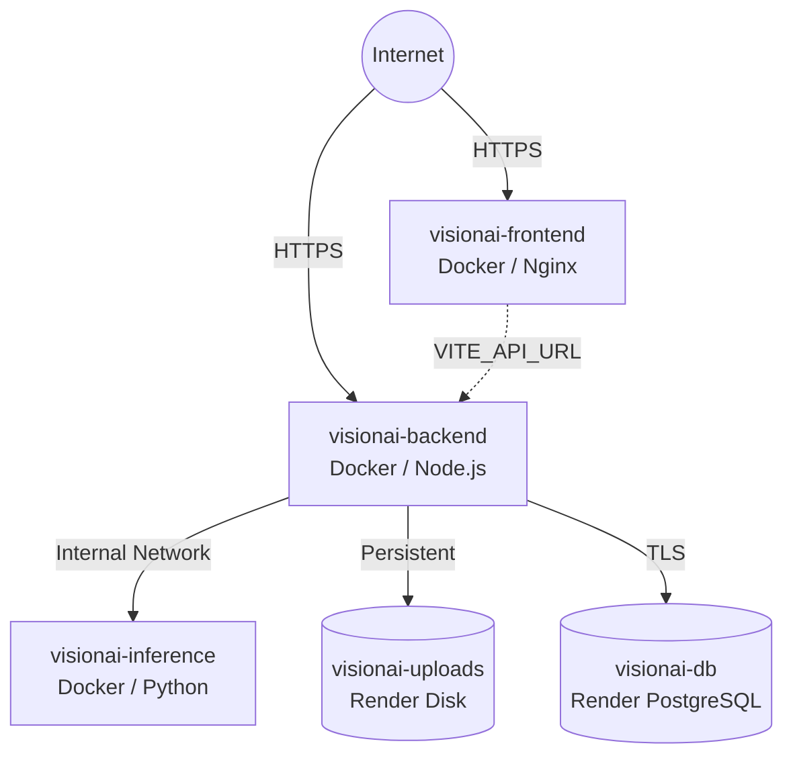

# Render Deployment Guide

This repository is configured for deployment on [Render](https://render.com) using a highly modular, decoupled microservice architecture.

## Architecture on Render

### Services

1. **`visionai-db`**: Render Managed PostgreSQL.
2. **`visionai-inference`**: Python FastAPI container serving the `DR_EfficientNetB0_V2.keras` model (V2 pipeline). Note: Requires a paid/standard plan due to ML model memory footprints.
3. **`visionai-backend`**: Node.js Express API. Uses a Render Persistent Disk (`/app/uploads`) to durably store Fundus Images and Clinical PDF reports.
4. **`visionai-frontend`**: Nginx container serving the built Vite React SPA.

## Prerequisites

- A [Render](https://render.com) account.
- The `render.yaml` Blueprint file is located at the root of the repository.

## Automated Deployment (Blueprint)

The simplest way to deploy is using Render's Infrastructure-as-Code feature:

1. Go to the Render Dashboard.
2. Click **New > Blueprint**.
3. Connect your GitHub repository.
4. Render will automatically detect `render.yaml` and provision the database, backend, inference service, and frontend.
5. All environment variables, service discovery (internal URLs), and persistent disks are pre-configured in `render.yaml`.

## Manual Deployment

If you prefer to deploy services individually:

### 1. Database
- Create a new PostgreSQL database.
- Save the **Internal Database URL**.

### 2. Inference Service
- Create a new Web Service.
- Source: Docker. Dockerfile: `./inference_service/Dockerfile`.
- Set Environment Variable: `ACTIVE_PROVIDER = python_v2`
- Save the **Internal Service URL**.

### 3. Backend API
- Create a new Web Service.
- Source: Docker. Dockerfile: `./backend/Dockerfile`.
- Add a Persistent Disk mounted at `/app/uploads`.
- **Environment Variables**:
  - `DATABASE_URL`: (Internal URL from Step 1)
  - `INFERENCE_SERVICE_URL`: (Internal URL from Step 2)
  - `TRUST_PROXY`: `1`
  - `NODE_ENV`: `production`
  - `STORAGE_BASE_PATH`: `/app/uploads`
  - `SESSION_SECRET`: (Generate a secure 32+ character string)
- **Start Command**: Wait for build, then Render handles `CMD ["node", "dist/server.js"]`. *Note: You must manually run `npx prisma migrate deploy` via the Render shell, or add it to a custom start script if deploying manually.*

### 4. Frontend
- Create a new Web Service.
- Source: Docker. Dockerfile: `./frontend/Dockerfile`.
- **Environment Variables**:
  - `VITE_API_URL`: (External URL from Step 3, e.g. `https://visionai-backend.onrender.com`)
- Update the Backend's `ALLOWED_ORIGIN` and `FRONTEND_URL` to match the Frontend's URL.

## MATLAB Engine Status

**Status: RETAINED FOR REFERENCE / SIMULATION**

The current production AI inference pipeline utilizes a translated Keras model (`DR_EfficientNetB0_V2.keras`) running strictly in Python (TensorFlow + FastAPI) to provide the 5-class DR classification and Grad-CAM explainability without the extreme container size and interactive licensing requirements of MATLAB. 

The original MATLAB models and Simulink resource simulation files remain safely isolated within the `matlab/` directory for operational analysis and are **not** deployed as a public endpoint on Render.

## Storage and Images

Render file systems are ephemeral. To ensure patient clinical reports and uploaded fundus images survive deployments, the Backend requires a **Render Persistent Disk** mounted at `/app/uploads` (as defined in `render.yaml`). If migrating to AWS S3 in the future, the disk can be decoupled.

## Health Checks

All services implement a `/health` or root health check. Render uses these to ensure zero-downtime deployments.
